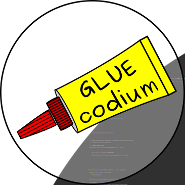

# Gluecodium [](https://github.com/heremaps/gluecodium/actions) [](https://jitpack.io/#heremaps/gluecodium)

Gluecodium **generates C++, Java**, **Swift**, and **Dart** code. The main purpose is generating C++ interfaces and
corresponding Java/Swift/Dart bindings for **Android**/**iOS**/**Flutter** respectively, but other platforms like **macOS**
and **Linux** work as well. Once implemented in C++ the code can be used directly from Java/Swift/Dart,
eliminating the need for writing conversions and bindings manually.
To simplify use of platform specific functions, Gluecodium is also able to generate interfaces/protocols
allowing use of Java/Swift/Dart implementations from C++.



A few similar systems exist (e.g. Djinni and Swig). However, these systems are unable to generate
bindings for modern languages like Swift or Dart.

## Getting started

The easiest way to run Gluecodium is by using the [Launcher tool](tools/README.md).
For a list of features and how to get started writing IDL, see [User guide](./docs/guide.md).

## Building and testing
Outside of IntelliJ you can invoke the following Gradle tasks to build
the entire project:

```bash
./gradlew build
```

## Command line parameters
For information on Gluecodium command line parameters run it with "-help":

```bash
./generate -help
```

Options listed in the "-help" can also be passed in a file, using "-options <file-name>" command
line parameter. Options file follows [".properties" file format](https://en.wikipedia.org/wiki/.properties).
* For command-line options with two names (short and long) the short name is used as a key in the
file.
* Boolean flags need to be specified with "true" value (e.g. "cache=true"). Specifying "false" for a
Boolean flag is also possible but does nothing.

## Caching of output files
Activation of caching feature in Gluecodium tool is done by passing the command line option, like:

```bash
./generate -cache -input <input folder> -output <output folder>
```

Running Gluecodium tool with this option will generate a directory called `.cache` inside `<output folder>`
(regardless of `-cache` option, caching gets automatically deactivated in case no valid output
directory is given). Inside this folder Gluecodium creates the cache index files (`cpp`, `android` and
`swift`) which contain hash values of all output files written in current run by the corresponding
generator. By utilizing the hash values, Gluecodium is able to prevent files from being overwritten
with exact same content on subsequent runs.

Additionally, files written in former Gluecodium tool runs which are not generated in current run will be
removed from built folder together with their cache entries.

They are two situations where all cache contents get automatically deleted:

* If an error occurs while generating files (because then, consistency between hash values and file
system cannot be guaranteed).
* If Gluecodium gets started with disabled caching, but on a folder containing cache index files
(Gluecodium might alter file contents of existing files or remove files etc. which could lead to
inconsistent cache).

## License

Copyright (C) 2016-2020 HERE Europe B.V.

See the [LICENSE](./LICENSE) file in the root of this project for license details.
