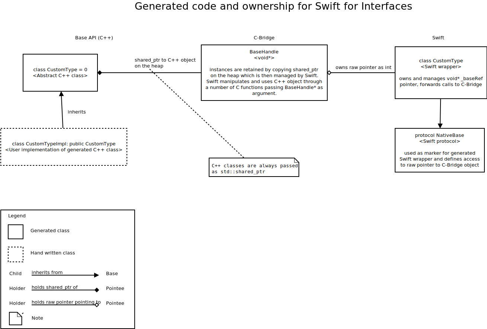

# Generated bindings for Swift

This should give some overview how the generated code for Swift bindings is structured.

## Generated layers for Swift

Bindings generation for Swift consists of the Swift code and a translation layer C-Bridge between Swift and the C++. As
Swift only supports C calling conventions, the interface to Swift must be pure C.

## Classes with C++ implementation

Lime IDL classes are generated as classes in Swift and abstract classes in C++. Calling into C++, objects needs to pass
through theC interface. The lifetime of the C++ object can be prolonged by holding a reference on Swift side.

## Interfaces with Swift implementation

For interfaces, Gluecodium generates a protocol in Swift, which can be implemented in Swift and passed to C++.
Gluecodium generates the necessary proxy class. Holding a `shared_ptr` to the proxy on C++ side will extend the life of
the Swift object.

## Preserving object type when passing subclass from C++ to Swift

Each base class or base interface (that means it does not inherit from anything) has an internal mapping called
"TypeRepository". In the C++ constructor, it will register its object with a *type init function*. Subclasses register
in the same TypeRepository with their own *type init function*. When the C++ object is passed to Swift, then in order to
create the Swift wrapper object, the *type init function* is called. It is implemented in Swift and declared with
`@_cdecl("CBridgeInit...")` in order to be callable from C. This way each object will have the Swift wrapper object
according to its actual type and type checking works natively on Swift side.
