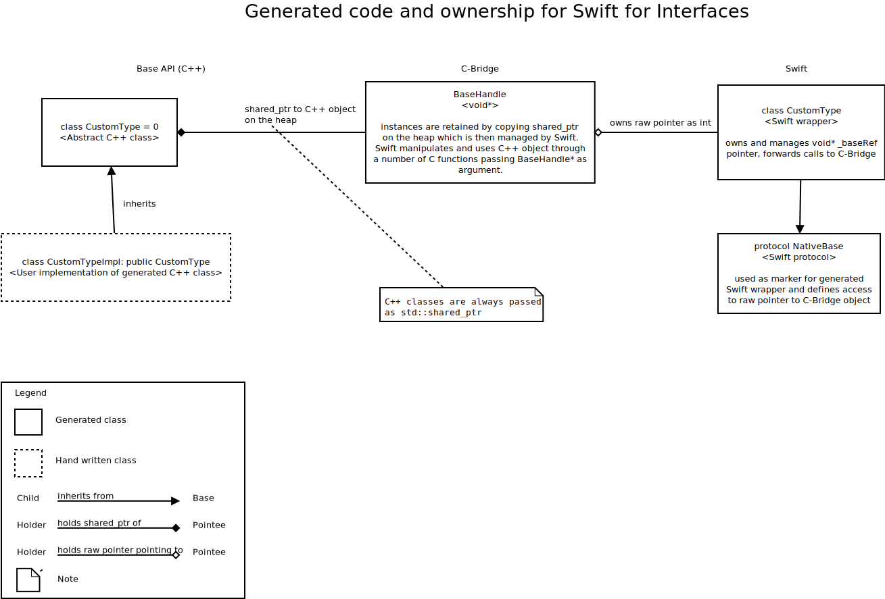
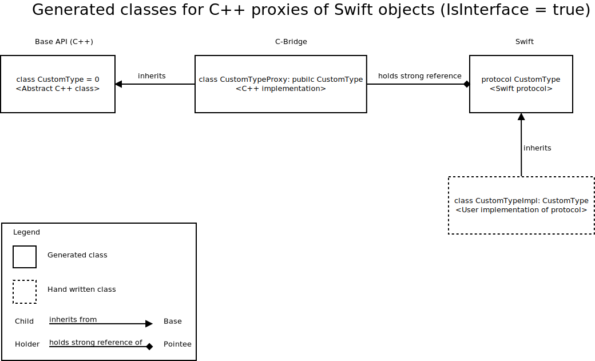

# Generated code for Swift

This should give some overview how the generated code for Swift bindings is structured.

## Generated layers for Swift

Bindings generation for Swift consists of the Swift code and some translation layer C-Bridge between Swift and the C++ BaseAPI. As Swift only supports C calling conventions, the interface to Swift must be pure C.

## Interfaces with C++ implementation

By default Franca interfaces are generated as classes in Swift and abstract classes in BaseAPI. Calling into C++ objects needs to pass through the C interface. The lifetime of the C++ object can be prolonged by holding a reference on Swift side.

## Interfaces with Swift implementation

If the deployment property `IsInterface=true` is set, Genium generates a protocal in Swift which can be implemented in Swift and passed to C++. Genium generates the necessary proxy class. Holding a `shared_ptr` to the proxy on C++ side will extend the life of the Swift object.

