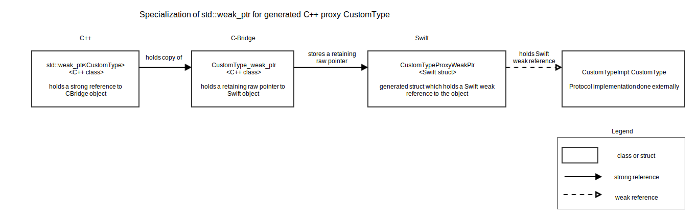

`std::weak_ptr` for proxy types
===============================

Interfaces marked with IsInterface=true which are generated as interface/protocol in Java/Swift are passed to C++ as proxy object.
These proxy objects are passed by `std::shared_ptr` and kept alive as long as the shared pointer is valid.
The proxies are stored in a cache so passing the same object to C++ a second time returns the same pointer if the first one is still valid.
The proxy object also retains the Java/Swift object.
Proxies are binding layer specific and implemented in JNI/C-Bridge layer.
With this setup `std::weak_ptr` will not work if C++ side doesn't also store `std::shared_ptr` to the same proxy.
In the following document an approach for an implementation for working `std::weak_ptr` is described.
For simplicity it's only investigated with Swift as implementation for Java is very similar.

Overview
--------

To allow a weak pointer to work properly it needs to be a weak reference on Swift side so it's properly kept track by [Swift ARC].
On C++ it needs to be a `shared_ptr` to said weak reference.



`std::weak_ptr` in Base API
---------------------------

Currently a C++ proxy of a Swift object only stored in a `std::weak_ptr` will get released immediately if it's the only reference on C++ side.
This is also true if the object on Swift side is still valid.
To work around this the C++ `std::weak_ptr` would need to peek into Swift to check whether or not the Swift object is still valid.
This means it needs to hold a strong reference to Swift object and therefore `std::weak_ptr` would need to be specialised for our generated proxies.
This is allowed for custom types [https://en.cppreference.com/w/cpp/language/extending_std].

Each Base API interface which has IsInterface=true needs to have specialized `std::weak_ptr` implementation.
If a type is marked with `IsInterface` in Genium there is a C++ abstract class and a Swift Protocol generated.
The user of Genium can implement either of those and both should work in a similar way on C++ and Swift side.
This means a potential specialisation for `std::weak_ptr` must work with native C++ implementations and with C++ proxies of Swift implementations.
To make this work the custom `std::weak_ptr` should have two exclusive members:
```C++
// store pointers for native C++ implementations
std::weak_ptr<void> m_cpp_impl;
// store strong pointer to proxy to keep it alive
std::shared_ptr<T> m_proxy;
```

As we're not guaranteed to have type information C++ we need to get this information differently: In the `weak_ptr` look up the pointer in the proxy cache.
As lookup in the cache is binding layer specific, it would be left undefined in C++ layer and implemented in C-Bridge.
These binding layer dependend functions would be:
* assign/construct from shared_ptr
* expired/use_count
* lock


Changes to Swift layer
----------------------

C-Bridge proxy currently stores a retaining unmanaged pointer to the Swift object.
If the proxy goes out of scope it releases the pointer.
To not retain the Swift object with `weak_ptr` a weak reference needs to be used on Swift side to allow [Swift ARC] to function normally.
This can be accomplished by storing a wrapper object in C-Bridge instead of the actual one.
This wrapper object then holds two references to the real object:
```Swift
internal class _{{name}}WrapperHolder {
    var strong_ptr: {{name}}?
    weak var weak_ptr: {{name}}?
...
};
```
When releasing all `std::shared_ptr`s to the object `strong_ptr` is set to `nil`.
When `lock`ing a `std::weak_ptr`, `weak_ptr` member is checked and assigned to `strong_ptr`.

Proxy cache in C-Bridge
-----------------------

In C-Bridge most of the implementation and house keeping would take place.
Currently the proxy cache holds a `std::shared_ptr` to the proxy.
This would need to change to:
```C++
struct CacheEntry {
    // keep track of std::shared_ptrs to the proxy
    std::weak_ptr< ProxyType > strong_proxy;
    // keep track of std::weak_ptrs to the proxy
    std::weak_ptr< ProxyType > weak_proxy;
    // internal pointer used to construct the others
    std::shared_ptr< ProxyType > proxy_ptr;
};
```
Both `weak_proxy` and `strong_proxy` have custom deleters which check whether or not the cache entry needs to be deleted.
Both weak and shared pointers are managed by shared_ptr in our implementation.
Getting a weak or shared pointer from the cache involves locking the appropriate weak_ptr and if it doesn't exist creating one with the correct deleter:
```C++
static std::shared_ptr<ProxyType>
get_weak_ptr( const void* proxy ) {
    Cache& cache = get_cache( );
    std::lock_guard< std::mutex > cache_lock( cache.mutex );

    auto it = cache.reverse_cache.find( proxy );
    if ( it == cache.reverse_cache.end( ) )
    {
        return {};
    }

    auto jt = cache.cache.find(it->second);
    assert( jt != cache.cache.end() );
    auto weak = jt->second.weak_proxy.lock();
    if ( !weak ) {
        weak = std::shared_ptr<ProxyType>(jt->second.proxy_ptr.get(), WeakDeleter());
        jt->second.weak_proxy = weak;
    }
    return weak;
}
```
When implementing `lock` for the `std::weak_ptr` the same needs to happen: check if there are still `std::shared_ptr` floating around and if not create a new one with custom deleter.
All these operations involve locking the cache.
As the cache is type specific this should not be a huge bottleneck.


Problems
========

This approach was implemented to see how feasible it is and a couple of problems emerged.

Swift ARC
---------

Storing a pointer to a wrapper object holding a weak pointer lead to a lot of "unconditional jump" error in Valgrind on Linux.
It is unclear whether or not [Swift ARC] can deal with weak references hidden in unmanaged objects stored only as pointers.
This would need further investigation, probably by examining the corresponding code in Swift compiler.
It's unclear how OSX/iOS implementation of Swift will handle this case.

Custom `std::weak_ptr`
----------------------

A custom implementation of `std::weak_ptr` is a big maintanance task as we not only need to make it fully functional with the proxy use case, but need to provide interoperability with native C++ implementations, subclasses, other std pointer types etc.

Complexity
----------

The solution is quite complex difficult to follow and reason about. This will put a big burden on future maintainers. Also it will very likely lead to lots of difficult to debug memory related issues.

[Swift ARC]: https://docs.swift.org/swift-book/LanguageGuide/AutomaticReferenceCounting.html

Possible Solutions
==================

There are some implementations possible to mitigate some of the above mentioned problems, but these were not tested in detail.

Move proxy cache to Swift
-------------------------

This would be a simple solution to allow storing the weak reference on Swift side without obfuscating it behind a raw pointer to Unmanaged object.

Move pointer members to CachedProxyBase
---------------------------------------

Moving the pointers to the base class instead of the cache would reduce the number of necessary lookups to creation and deletion.

Use Objective C associated object
---------------------------------

This only works on Apple platforms as it needs the Objective C runtime.
If there is a similar solution for Java available it would be worth considering though.
The idea is to associate an Objective C object with the proxy.
This allows to get a callback on object destruction.
With such a callback it should be possible to modify proxy to:
* store a non-owning shared_ptr
* on destruction of Swift object invalidate pointer
This means no custom std::weak_ptr implementation would be necessary.

If there is a similar possibility to get a callback on finalizing available for Java, then this approach should be investigated further.
